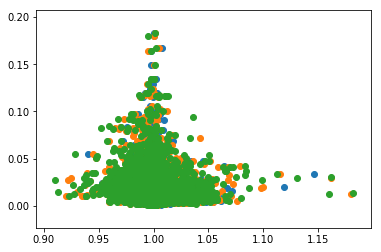
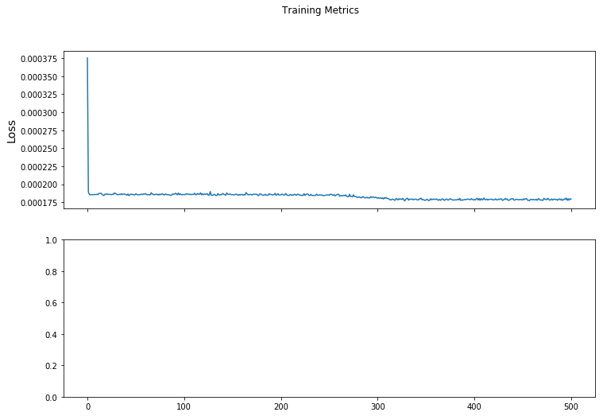
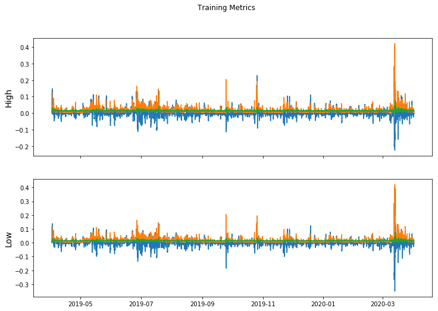
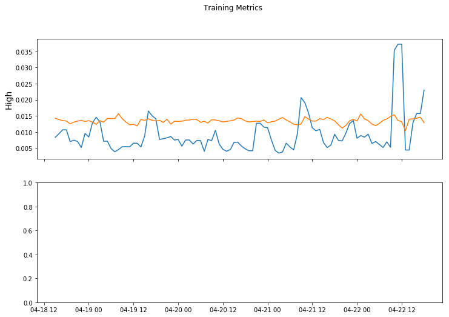

```python
# Example from https://www.tensorflow.org/tutorials/customization/custom_training_walkthrough
```


```python
# Building a simple financial model by getting data from the Pax API
```

# Financial Model Training
This guide uses machine learning to categorize a previous price pattern as volitile in the near future or not volitile. Getting a read on volatitliy can provide fund managers with valuable data


```python
import os
import matplotlib.pyplot as plt
import tensorflow as tf
print("TensorFlow version: {}".format(tf.__version__))
print("Eager execution: {}".format(tf.executing_eagerly()))
```

    TensorFlow version: 2.2.0
    Eager execution: True


# A Volatility classification provlem
Imagine you see many price fluxuations accross a variety of securities. You would like to get a read on what the 24 volatility looks like. Depending on your theories about direction, knowing volatility might lead you to either invest more, or hedge. 

The Data we will look at has the following properties.
1. HighPrice
2. LowPrice
3. TimeIndex

We will preprocess the data to normalize it into returns, below.

# We Import the Pax development kit and look at some sample raw data 


```python
import paxdk
 
import json
with open("../.config") as f:
    data = json.load(f)
api_key = data['api_key']    
 
pq = paxdk.PaxFinancialAPI(url_version='dev',api_key=api_key)    
```

    PaxFinancialAPI v4 loaded!


```python
import pandas as pd
import datetime

bars = pq.get_historical_hour({'api_key':api_key,
                                'time_in':datetime.datetime(2018,4,1,10),
                                'time_end':datetime.datetime(2019,4,1,12),
                                'Ticker':'BTCUSDT',
                                                             },remote=True)
#print(bars)
df=pd.DataFrame(bars)
display(df.head())
```


<div>
<style scoped>
    .dataframe tbody tr th:only-of-type {
        vertical-align: middle;
    }

    .dataframe tbody tr th {
        vertical-align: top;
    }

    .dataframe thead th {
        text-align: right;
    }
</style>
<table border="1" class="dataframe">
  <thead>
    <tr style="text-align: right;">
      <th></th>
      <th>ClosePrice</th>
      <th>DateTime</th>
      <th>HighPrice</th>
      <th>LowPrice</th>
      <th>OpenPrice</th>
      <th>Ticker</th>
      <th>_id</th>
      <th>close</th>
      <th>date_time</th>
      <th>from_symbol</th>
      <th>high</th>
      <th>low</th>
      <th>open</th>
      <th>requested_date</th>
      <th>time</th>
      <th>to_symbol</th>
      <th>volumefrom</th>
      <th>volumeto</th>
    </tr>
  </thead>
  <tbody>
    <tr>
      <th>0</th>
      <td>6699.95</td>
      <td>2018-04-01 10:00:00</td>
      <td>6758.89</td>
      <td>6657.88</td>
      <td>6757.17</td>
      <td>BTCUSDT</td>
      <td>None</td>
      <td>6699.95</td>
      <td>2018-04-01 10:00:00</td>
      <td>BTC</td>
      <td>6758.89</td>
      <td>6657.88</td>
      <td>6757.17</td>
      <td>2020-03-22T18:47:40.640000</td>
      <td>1522576800</td>
      <td>USDT</td>
      <td>2696.59</td>
      <td>18068244.10</td>
    </tr>
    <tr>
      <th>1</th>
      <td>6691.29</td>
      <td>2018-04-01 11:00:00</td>
      <td>6706.96</td>
      <td>6648.62</td>
      <td>6705.50</td>
      <td>BTCUSDT</td>
      <td>None</td>
      <td>6691.29</td>
      <td>2018-04-01 11:00:00</td>
      <td>BTC</td>
      <td>6706.96</td>
      <td>6648.62</td>
      <td>6705.50</td>
      <td>2020-03-22T18:47:40.640000</td>
      <td>1522580400</td>
      <td>USDT</td>
      <td>2499.61</td>
      <td>16697521.75</td>
    </tr>
    <tr>
      <th>2</th>
      <td>6687.22</td>
      <td>2018-04-01 12:00:00</td>
      <td>6730.72</td>
      <td>6676.31</td>
      <td>6690.27</td>
      <td>BTCUSDT</td>
      <td>None</td>
      <td>6687.22</td>
      <td>2018-04-01 12:00:00</td>
      <td>BTC</td>
      <td>6730.72</td>
      <td>6676.31</td>
      <td>6690.27</td>
      <td>2020-03-22T18:47:40.640000</td>
      <td>1522584000</td>
      <td>USDT</td>
      <td>2829.32</td>
      <td>18958201.96</td>
    </tr>
    <tr>
      <th>3</th>
      <td>6554.28</td>
      <td>2018-04-01 13:00:00</td>
      <td>6689.66</td>
      <td>6530.52</td>
      <td>6689.45</td>
      <td>BTCUSDT</td>
      <td>None</td>
      <td>6554.28</td>
      <td>2018-04-01 13:00:00</td>
      <td>BTC</td>
      <td>6689.66</td>
      <td>6530.52</td>
      <td>6689.45</td>
      <td>2020-03-22T18:47:40.640000</td>
      <td>1522587600</td>
      <td>USDT</td>
      <td>4815.35</td>
      <td>31727500.96</td>
    </tr>
    <tr>
      <th>4</th>
      <td>6509.23</td>
      <td>2018-04-01 14:00:00</td>
      <td>6554.28</td>
      <td>6446.22</td>
      <td>6554.28</td>
      <td>BTCUSDT</td>
      <td>None</td>
      <td>6509.23</td>
      <td>2018-04-01 14:00:00</td>
      <td>BTC</td>
      <td>6554.28</td>
      <td>6446.22</td>
      <td>6554.28</td>
      <td>2020-03-22T18:47:40.640000</td>
      <td>1522591200</td>
      <td>USDT</td>
      <td>5764.29</td>
      <td>37440056.70</td>
    </tr>
  </tbody>
</table>
</div>


# Prepare Training Data CSV
Next, we would like to save this training data, locally, into a CSV file. In this tutorial we will try to use the past 10 hours, to forcast volitility in the next one hour. Thus, we would like to construct the following vector:


X_1 = < HighPrice_1/HighPrice_1 ... HighPriceN/HighPrice_1> 

X_2 = < LowPrice_1/LowPrice_1 ...  LowPrice_N/LowPrice_1 >

Y = < HighPrice_(N+1) - LowPrice_(N+1)>

Thus we have a feature given by


f = X_1 & X_2 & Y


```python
features = []
count = 0
for index,row in df.iterrows():
    if count >= 13:
        i_0 = index - 13
        i_n = index -3
        i_n1 = index -2
        i_n3 = index
        
        x = df.loc[i_0:i_n]
        x1 = x['HighPrice']/x['HighPrice'].iloc[0]
        x2 = x['LowPrice']/x['LowPrice'].iloc[0]
        
        y = df.loc[i_n1:i_n3]
        high =y['HighPrice'].max()
        low = y['LowPrice'].min()
        yVal = (high-low)/low
        
        f =x1.to_list() + x2.to_list() +[yVal]
        features.append(f)
    count = count + 1
column_names = []
for i in range(0,11):
    column_names.append('HighPrice_'+str(i))
for i in range(0,11):
    column_names.append('LowPrice_'+str(i))
column_names.append('vol')

feature_names = column_names[:-1]
label_name = column_names[-1]

print("Features: {}".format(feature_names))
print("Label: {}".format(label_name))
train = pd.DataFrame(features, columns = column_names)  
train.to_csv('financialFeaturesTrain.csv', index=False)
```

    Features: ['HighPrice_0', 'HighPrice_1', 'HighPrice_2', 'HighPrice_3', 'HighPrice_4', 'HighPrice_5', 'HighPrice_6', 'HighPrice_7', 'HighPrice_8', 'HighPrice_9', 'HighPrice_10', 'LowPrice_0', 'LowPrice_1', 'LowPrice_2', 'LowPrice_3', 'LowPrice_4', 'LowPrice_5', 'LowPrice_6', 'LowPrice_7', 'LowPrice_8', 'LowPrice_9', 'LowPrice_10']
    Label: vol


# With Training data prepared, we can now consider our model. 
It should support 20 inputs and one output


```python
train.head()
```


<div>
<style scoped>
    .dataframe tbody tr th:only-of-type {
        vertical-align: middle;
    }

    .dataframe tbody tr th {
        vertical-align: top;
    }

    .dataframe thead th {
        text-align: right;
    }
</style>
<table border="1" class="dataframe">
  <thead>
    <tr style="text-align: right;">
      <th></th>
      <th>HighPrice_0</th>
      <th>HighPrice_1</th>
      <th>HighPrice_2</th>
      <th>HighPrice_3</th>
      <th>HighPrice_4</th>
      <th>HighPrice_5</th>
      <th>HighPrice_6</th>
      <th>HighPrice_7</th>
      <th>HighPrice_8</th>
      <th>HighPrice_9</th>
      <th>...</th>
      <th>LowPrice_2</th>
      <th>LowPrice_3</th>
      <th>LowPrice_4</th>
      <th>LowPrice_5</th>
      <th>LowPrice_6</th>
      <th>LowPrice_7</th>
      <th>LowPrice_8</th>
      <th>LowPrice_9</th>
      <th>LowPrice_10</th>
      <th>vol</th>
    </tr>
  </thead>
  <tbody>
    <tr>
      <th>0</th>
      <td>1.0</td>
      <td>0.992317</td>
      <td>0.995832</td>
      <td>0.989757</td>
      <td>0.969727</td>
      <td>0.967749</td>
      <td>1.014300</td>
      <td>1.015116</td>
      <td>1.014511</td>
      <td>1.029213</td>
      <td>...</td>
      <td>1.002768</td>
      <td>0.980871</td>
      <td>0.968209</td>
      <td>0.969008</td>
      <td>0.967476</td>
      <td>1.016109</td>
      <td>1.013139</td>
      <td>1.021687</td>
      <td>1.029242</td>
      <td>0.023037</td>
    </tr>
    <tr>
      <th>1</th>
      <td>1.0</td>
      <td>1.003543</td>
      <td>0.997421</td>
      <td>0.977236</td>
      <td>0.975242</td>
      <td>1.022153</td>
      <td>1.022976</td>
      <td>1.022366</td>
      <td>1.037182</td>
      <td>1.035351</td>
      <td>...</td>
      <td>0.982237</td>
      <td>0.969558</td>
      <td>0.970358</td>
      <td>0.968824</td>
      <td>1.017524</td>
      <td>1.014550</td>
      <td>1.023110</td>
      <td>1.030676</td>
      <td>1.022892</td>
      <td>0.038571</td>
    </tr>
    <tr>
      <th>2</th>
      <td>1.0</td>
      <td>0.993900</td>
      <td>0.973786</td>
      <td>0.971799</td>
      <td>1.018545</td>
      <td>1.019365</td>
      <td>1.018757</td>
      <td>1.033521</td>
      <td>1.031696</td>
      <td>1.026278</td>
      <td>...</td>
      <td>0.965536</td>
      <td>0.966333</td>
      <td>0.964805</td>
      <td>1.013304</td>
      <td>1.010343</td>
      <td>1.018867</td>
      <td>1.026401</td>
      <td>1.018650</td>
      <td>1.011343</td>
      <td>0.035903</td>
    </tr>
    <tr>
      <th>3</th>
      <td>1.0</td>
      <td>0.979763</td>
      <td>0.977764</td>
      <td>1.024796</td>
      <td>1.025622</td>
      <td>1.025010</td>
      <td>1.039865</td>
      <td>1.038029</td>
      <td>1.032577</td>
      <td>1.022608</td>
      <td>...</td>
      <td>0.987906</td>
      <td>0.986344</td>
      <td>1.035925</td>
      <td>1.032898</td>
      <td>1.041612</td>
      <td>1.049315</td>
      <td>1.041390</td>
      <td>1.033921</td>
      <td>1.036584</td>
      <td>0.035653</td>
    </tr>
    <tr>
      <th>4</th>
      <td>1.0</td>
      <td>0.997960</td>
      <td>1.045964</td>
      <td>1.046806</td>
      <td>1.046182</td>
      <td>1.061343</td>
      <td>1.059470</td>
      <td>1.053905</td>
      <td>1.043730</td>
      <td>1.041664</td>
      <td>...</td>
      <td>0.999243</td>
      <td>1.049472</td>
      <td>1.046405</td>
      <td>1.055234</td>
      <td>1.063037</td>
      <td>1.055009</td>
      <td>1.047442</td>
      <td>1.050139</td>
      <td>1.050392</td>
      <td>0.015825</td>
    </tr>
  </tbody>
</table>
<p>5 rows × 23 columns</p>
</div>


```python
print(train['vol'].min())
print(train['vol'].max())
print(train['vol'].mean())
print(train['vol'].median())

```

    0.0010366668925870712
    0.18285231786728265
    0.0136237851168539
    0.009894610333574912


# We can plot the dimensions
Below we plot three of the dimensions, looking for any coorelation with the y Axis


```python
plt.scatter(train['HighPrice_1'],
            train['vol'])
plt.scatter(train['HighPrice_2'],
            train['vol'])
plt.scatter(train['HighPrice_3'],
            train['vol'])

```


    <matplotlib.collections.PathCollection at 0x7fb469cdc668>





# Prepare the dataframe for training
Next, we prepare the dataset for training. We opt to load data from a csv file.


```python
financialFeatures = open("financialFeaturesTrain.csv")
batch_size = 1000
print(column_names)
print(label_name)
train_dataset = tf.data.experimental.make_csv_dataset(
    file_pattern='financialFeaturesTrain.csv',
    batch_size=batch_size,
    column_names=column_names,
    label_name=label_name,
    num_epochs=1)
```

    ['HighPrice_0', 'HighPrice_1', 'HighPrice_2', 'HighPrice_3', 'HighPrice_4', 'HighPrice_5', 'HighPrice_6', 'HighPrice_7', 'HighPrice_8', 'HighPrice_9', 'HighPrice_10', 'LowPrice_0', 'LowPrice_1', 'LowPrice_2', 'LowPrice_3', 'LowPrice_4', 'LowPrice_5', 'LowPrice_6', 'LowPrice_7', 'LowPrice_8', 'LowPrice_9', 'LowPrice_10', 'vol']
    vol


```python
features, labels = next(iter(train_dataset))

#print(features)
```


```python
def pack_features_vector(features, labels):
    """Pack the features into a single array."""
    features = tf.stack(list(features.values()), axis=1)
    return features, labels
```


```python
train_dataset = train_dataset.map(pack_features_vector)
```


```python
features, labels = next(iter(train_dataset))

print(len(features))
print(len(labels))

lbl2 = tf.reshape(labels,[len(labels),1])

print(tf.shape(labels))
print(tf.shape(lbl2))


```

    1000
    1000
    tf.Tensor([1000], shape=(1,), dtype=int32)
    tf.Tensor([1000    1], shape=(2,), dtype=int32)


# Train a model with the data


```python
model = tf.keras.Sequential([
  tf.keras.layers.Dense(10, activation=tf.nn.relu, input_shape=(22,)),  # input shape required
  tf.keras.layers.Dense(15, activation=tf.nn.relu),
  tf.keras.layers.Dense(5, activation=tf.nn.relu),
  tf.keras.layers.Dense(8, activation=tf.nn.relu),
  tf.keras.layers.Dense(3, activation=tf.nn.relu),
  tf.keras.layers.Dense(1)
])
```


```python
predictions = model(features)
predictions[:5]
```


    <tf.Tensor: shape=(5, 1), dtype=float32, numpy=
    array([[0.038569  ],
           [0.03765087],
           [0.03920037],
           [0.0385066 ],
           [0.03959331]], dtype=float32)>


```python
tf.nn.softmax(predictions[:5])
```


    <tf.Tensor: shape=(5, 1), dtype=float32, numpy=
    array([[1.],
           [1.],
           [1.],
           [1.],
           [1.]], dtype=float32)>


```python
print(predictions[0])
print("Prediction: {}".format(predictions))
#print("    Labels: {}".format(labels))
```

    tf.Tensor([0.038569], shape=(1,), dtype=float32)
    Prediction: [[0.038569  ]
     [0.03765087]
     [0.03920037]
     [0.0385066 ]
     [0.03959331]
     [0.04424696]
     [0.04123408]
     [0.04195625]
     [0.03962528]
     [0.04321341]
     [0.04165633]
     [0.03775265]
     [0.03831117]
     [0.04033074]
     [0.03892118]
     [0.03953713]
     [0.03558092]
     [0.03963558]
     [0.0361141 ]
     [0.04892692]
     [0.04214603]
     [0.0469989 ]
     [0.03947001]
     [0.0388777 ]
     [0.03530068]
     [0.03884779]
     [0.03827623]
     [0.03836274]
     [0.03905858]
     [0.03698761]
     [0.0396426 ]
     [0.04141189]
     [0.03909231]
     [0.0380435 ]
     [0.03940591]
     [0.03881129]
     [0.03868918]
     [0.03797795]
     [0.03572955]
     [0.04333398]
     [0.03937116]
     [0.03804032]
     [0.04536039]
     [0.03820644]
     [0.03694482]
     [0.03813341]
     [0.03871745]
     [0.03868522]
     [0.03872392]
     [0.03845417]
     [0.03719767]
     [0.03874841]
     [0.03917631]
     [0.03520682]
     [0.04398126]
     [0.03741507]
     [0.03722136]
     [0.03878302]
     [0.0391434 ]
     [0.04002091]
     [0.03853732]
     [0.03747148]
     [0.03982392]
     [0.04113126]
     [0.03820557]
     [0.04100798]
     [0.03797901]
     [0.03902249]
     [0.03814655]
     [0.03778191]
     [0.03938741]
     [0.04140336]
     [0.03692428]
     [0.03915573]
     [0.03726061]
     [0.0393752 ]
     [0.03758205]
     [0.0369909 ]
     [0.03818985]
     [0.03946439]
     [0.03960165]
     [0.03428949]
     [0.03880216]
     [0.03509308]
     [0.03949572]
     [0.04034482]
     [0.03930138]
     [0.04050142]
     [0.03967608]
     [0.0374159 ]
     [0.03929893]
     [0.03768307]
     [0.03894092]
     [0.03731332]
     [0.0392985 ]
     [0.03981052]
     [0.03715374]
     [0.0392436 ]
     [0.03947096]
     [0.03914097]
     [0.03691188]
     [0.02901078]
     [0.03830011]
     [0.03988568]
     [0.03850513]
     [0.04064684]
     [0.03937694]
     [0.04135832]
     [0.03781167]
     [0.03714032]
     [0.0396352 ]
     [0.03804217]
     [0.04037361]
     [0.0407215 ]
     [0.03843111]
     [0.0392019 ]
     [0.03842735]
     [0.03860655]
     [0.03798204]
     [0.03916329]
     [0.03918048]
     [0.04010442]
     [0.03660239]
     [0.03912667]
     [0.04027248]
     [0.04028429]
     [0.03812153]
     [0.03811083]
     [0.03665927]
     [0.04039969]
     [0.04101412]
     [0.03849058]
     [0.03924846]
     [0.03876106]
     [0.03903741]
     [0.04121184]
     [0.03934453]
     [0.0414676 ]
     [0.03891997]
     [0.03673811]
     [0.0383643 ]
     [0.03904244]
     [0.03858996]
     [0.04050688]
     [0.03827599]
     [0.03756284]
     [0.03577891]
     [0.0397258 ]
     [0.03886268]
     [0.03873537]
     [0.03756614]
     [0.03962603]
     [0.03857232]
     [0.03664986]
     [0.03766564]
     [0.03896384]
     [0.03936819]
     [0.03999621]
     [0.03914907]
     [0.04062368]
     [0.03441217]
     [0.03493451]
     [0.0373286 ]
     [0.03926901]
     [0.03890692]
     [0.03837379]
     [0.03916068]
     [0.0396251 ]
     [0.03859901]
     [0.03868587]
     [0.03917927]
     [0.03586582]
     [0.04123468]
     [0.04039554]
     [0.03470634]
     [0.04130817]
     [0.03867784]
     [0.03874458]
     [0.04034585]
     [0.03786853]
     [0.03622008]
     [0.03894199]
     [0.03742034]
     [0.03578892]
     [0.03710689]
     [0.0381896 ]
     [0.03873431]
     [0.04322595]
     [0.03261703]
     [0.0375791 ]
     [0.039001  ]
     [0.04124894]
     [0.04053041]
     [0.03995956]
     [0.03875839]
     [0.04000258]
     [0.03857391]
     [0.03878947]
     [0.03992121]
     [0.03747514]
     [0.03756332]
     [0.03825235]
     [0.03833923]
     [0.03807386]
     [0.03816859]
     [0.04134332]
     [0.04505793]
     [0.03712346]
     [0.03954553]
     [0.03856289]
     [0.03641774]
     [0.03523241]
     [0.0388549 ]
     [0.03319836]
     [0.03931322]
     [0.04001008]
     [0.03759197]
     [0.03797436]
     [0.03178457]
     [0.03407771]
     [0.04243454]
     [0.03892335]
     [0.03759116]
     [0.04093348]
     [0.03870394]
     [0.03925588]
     [0.03876745]
     [0.03775708]
     [0.03969191]
     [0.03699835]
     [0.0385349 ]
     [0.03852637]
     [0.03690607]
     [0.03721617]
     [0.04172773]
     [0.04010609]
     [0.03913419]
     [0.04744392]
     [0.0374439 ]
     [0.03961237]
     [0.03861289]
     [0.0391618 ]
     [0.03841427]
     [0.03530908]
     [0.04003968]
     [0.04209953]
     [0.04228611]
     [0.03835644]
     [0.04199772]
     [0.03844409]
     [0.03992601]
     [0.04094704]
     [0.036504  ]
     [0.0381203 ]
     [0.03957856]
     [0.03840315]
     [0.04151951]
     [0.03936299]
     [0.0392085 ]
     [0.03910521]
     [0.03814902]
     [0.04083715]
     [0.03953743]
     [0.03897725]
     [0.03905413]
     [0.03980377]
     [0.03928068]
     [0.03786244]
     [0.04078045]
     [0.03889805]
     [0.03705873]
     [0.03845338]
     [0.0397757 ]
     [0.03972657]
     [0.04847615]
     [0.04129165]
     [0.04130876]
     [0.03259105]
     [0.03820034]
     [0.03998916]
     [0.039429  ]
     [0.04178483]
     [0.03778099]
     [0.04001679]
     [0.04237228]
     [0.04342419]
     [0.04089898]
     [0.03901666]
     [0.04345297]
     [0.04114066]
     [0.03981064]
     [0.03976627]
     [0.04023398]
     [0.03930771]
     [0.03921989]
     [0.0394773 ]
     [0.03921889]
     [0.03957411]
     [0.03895726]
     [0.04020206]
     [0.03648794]
     [0.0370891 ]
     [0.0397347 ]
     [0.03970299]
     [0.03712651]
     [0.03380956]
     [0.03894471]
     [0.03883558]
     [0.03959493]
     [0.04178293]
     [0.04186705]
     [0.03509337]
     [0.05197562]
     [0.03895569]
     [0.0365837 ]
     [0.03857426]
     [0.03866308]
     [0.03876154]
     [0.03671599]
     [0.038773  ]
     [0.03489194]
     [0.04040771]
     [0.04315493]
     [0.03970795]
     [0.0370848 ]
     [0.03632276]
     [0.03873324]
     [0.05185534]
     [0.04043281]
     [0.04006938]
     [0.03999323]
     [0.03808817]
     [0.03713813]
     [0.0363351 ]
     [0.03918604]
     [0.03724183]
     [0.03904632]
     [0.03950948]
     [0.03948697]
     [0.05009869]
     [0.04040629]
     [0.03859838]
     [0.04010234]
     [0.0382832 ]
     [0.03888965]
     [0.04008287]
     [0.03815214]
     [0.0305594 ]
     [0.03839163]
     [0.04441015]
     [0.03973769]
     [0.03891914]
     [0.03385357]
     [0.03938643]
     [0.03794034]
     [0.03895925]
     [0.03878127]
     [0.03801858]
     [0.03241426]
     [0.03795533]
     [0.0311499 ]
     [0.03958029]
     [0.03919963]
     [0.0395925 ]
     [0.03909474]
     [0.04282526]
     [0.03583949]
     [0.03545209]
     [0.03964991]
     [0.03935806]
     [0.03885984]
     [0.03843717]
     [0.04157445]
     [0.03824202]
     [0.03981731]
     [0.03860658]
     [0.03655084]
     [0.03955515]
     [0.03752559]
     [0.04184609]
     [0.03610064]
     [0.03951543]
     [0.03204401]
     [0.03827269]
     [0.03762658]
     [0.03888681]
     [0.04203331]
     [0.03536734]
     [0.03994231]
     [0.03752882]
     [0.03959417]
     [0.03893945]
     [0.0382049 ]
     [0.03910001]
     [0.03670105]
     [0.03663283]
     [0.04134712]
     [0.03971764]
     [0.03467524]
     [0.03706975]
     [0.03865787]
     [0.03790209]
     [0.03894317]
     [0.04169463]
     [0.03795625]
     [0.04040797]
     [0.0379596 ]
     [0.0385391 ]
     [0.03873547]
     [0.03857594]
     [0.03146371]
     [0.04102794]
     [0.03956243]
     [0.03883067]
     [0.04160377]
     [0.03736235]
     [0.03701449]
     [0.03892388]
     [0.03942638]
     [0.04433874]
     [0.03857842]
     [0.03777352]
     [0.03910766]
     [0.04001529]
     [0.03914206]
     [0.03720076]
     [0.0403523 ]
     [0.04113088]
     [0.03815831]
     [0.03856142]
     [0.04082567]
     [0.03353706]
     [0.03883792]
     [0.03922738]
     [0.03762002]
     [0.03895066]
     [0.03937803]
     [0.03944314]
     [0.04530653]
     [0.03820577]
     [0.03468079]
     [0.03782212]
     [0.04219671]
     [0.03844768]
     [0.03877629]
     [0.03713211]
     [0.0372027 ]
     [0.03712878]
     [0.03868926]
     [0.04061904]
     [0.0395146 ]
     [0.04014695]
     [0.03674563]
     [0.04158662]
     [0.0341589 ]
     [0.03747896]
     [0.03677897]
     [0.03857759]
     [0.03864173]
     [0.03826404]
     [0.04008041]
     [0.04067484]
     [0.03816079]
     [0.04250804]
     [0.03977491]
     [0.03499749]
     [0.04247092]
     [0.04001192]
     [0.0409091 ]
     [0.04326319]
     [0.03852127]
     [0.04119407]
     [0.03792929]
     [0.04049643]
     [0.03972281]
     [0.04213456]
     [0.03884303]
     [0.03844047]
     [0.03921452]
     [0.03915523]
     [0.04028229]
     [0.03747702]
     [0.03951904]
     [0.0404039 ]
     [0.0329714 ]
     [0.03765035]
     [0.03774353]
     [0.03558877]
     [0.03852395]
     [0.03634815]
     [0.03892336]
     [0.04599706]
     [0.03707765]
     [0.03991942]
     [0.02955668]
     [0.03845736]
     [0.04003663]
     [0.03948554]
     [0.05778731]
     [0.03684128]
     [0.0367476 ]
     [0.03887048]
     [0.03960612]
     [0.03842979]
     [0.03594333]
     [0.03393809]
     [0.04043777]
     [0.03710074]
     [0.03785238]
     [0.03646796]
     [0.03992987]
     [0.04024695]
     [0.03923193]
     [0.03703117]
     [0.03877403]
     [0.04012576]
     [0.05525079]
     [0.03863815]
     [0.03910846]
     [0.03871407]
     [0.03483206]
     [0.03760816]
     [0.03783995]
     [0.04544906]
     [0.03996217]
     [0.03814497]
     [0.03760006]
     [0.03625783]
     [0.03853989]
     [0.03809365]
     [0.0387073 ]
     [0.03813697]
     [0.03763001]
     [0.03971267]
     [0.03743938]
     [0.03865566]
     [0.03641412]
     [0.04189228]
     [0.04105267]
     [0.03816974]
     [0.03837388]
     [0.03598989]
     [0.03872033]
     [0.04049806]
     [0.036623  ]
     [0.03924996]
     [0.03922351]
     [0.03725365]
     [0.03848085]
     [0.0401666 ]
     [0.03940682]
     [0.0395199 ]
     [0.04216575]
     [0.03702401]
     [0.03968323]
     [0.03800229]
     [0.03859933]
     [0.03801809]
     [0.03874958]
     [0.0411062 ]
     [0.03587994]
     [0.03927006]
     [0.03998085]
     [0.03401083]
     [0.04289651]
     [0.03990664]
     [0.03686461]
     [0.03762325]
     [0.03833044]
     [0.03743975]
     [0.04226765]
     [0.03253172]
     [0.03563966]
     [0.0367875 ]
     [0.03797027]
     [0.04106762]
     [0.03961208]
     [0.03695561]
     [0.03929337]
     [0.03576208]
     [0.03953876]
     [0.04219881]
     [0.03916546]
     [0.03488909]
     [0.03906391]
     [0.03878775]
     [0.03804066]
     [0.03775688]
     [0.03866367]
     [0.03856613]
     [0.03907886]
     [0.039122  ]
     [0.03665721]
     [0.03943763]
     [0.04018826]
     [0.04282654]
     [0.03469293]
     [0.03919582]
     [0.03907157]
     [0.03892175]
     [0.03909744]
     [0.03934123]
     [0.0388851 ]
     [0.04095195]
     [0.03872366]
     [0.03897649]
     [0.03945192]
     [0.0382873 ]
     [0.03831583]
     [0.03913344]
     [0.03772403]
     [0.04126994]
     [0.03877648]
     [0.03563643]
     [0.03962283]
     [0.03968015]
     [0.03868651]
     [0.03857489]
     [0.03867898]
     [0.04339314]
     [0.03948985]
     [0.0394482 ]
     [0.03900477]
     [0.03865913]
     [0.03403853]
     [0.04276864]
     [0.0326537 ]
     [0.03716883]
     [0.03546585]
     [0.0387447 ]
     [0.03952393]
     [0.03544309]
     [0.03569012]
     [0.03538093]
     [0.03758643]
     [0.03875177]
     [0.04470397]
     [0.03913021]
     [0.04118896]
     [0.03727551]
     [0.04394365]
     [0.03832185]
     [0.04076952]
     [0.03633638]
     [0.04008627]
     [0.03862727]
     [0.03732243]
     [0.04094503]
     [0.03860754]
     [0.03890298]
     [0.03964204]
     [0.03845462]
     [0.04129693]
     [0.03696348]
     [0.038624  ]
     [0.04347173]
     [0.0336889 ]
     [0.03838321]
     [0.0383204 ]
     [0.03885264]
     [0.03895555]
     [0.03974965]
     [0.03889891]
     [0.04197858]
     [0.0354906 ]
     [0.03804429]
     [0.03944278]
     [0.0398284 ]
     [0.03863979]
     [0.03646773]
     [0.03823397]
     [0.03852018]
     [0.04013265]
     [0.03640793]
     [0.03521839]
     [0.04115462]
     [0.04004195]
     [0.03892189]
     [0.03608857]
     [0.03239844]
     [0.03881932]
     [0.03911539]
     [0.03994982]
     [0.03643171]
     [0.03393359]
     [0.03772165]
     [0.0321841 ]
     [0.03938777]
     [0.03900529]
     [0.03856419]
     [0.03650805]
     [0.0396934 ]
     [0.04276849]
     [0.0460182 ]
     [0.04452694]
     [0.03810155]
     [0.03771506]
     [0.03680414]
     [0.03747892]
     [0.02442369]
     [0.04139097]
     [0.03878581]
     [0.03673006]
     [0.03733681]
     [0.03848847]
     [0.03858634]
     [0.03828692]
     [0.0368921 ]
     [0.04271405]
     [0.04026754]
     [0.03745576]
     [0.03868051]
     [0.04125336]
     [0.03810949]
     [0.03814227]
     [0.03841351]
     [0.03971858]
     [0.03860172]
     [0.038844  ]
     [0.03952545]
     [0.03763779]
     [0.04361059]
     [0.03847064]
     [0.03705328]
     [0.03975524]
     [0.04087503]
     [0.0410757 ]
     [0.03926188]
     [0.03837729]
     [0.03947469]
     [0.03828916]
     [0.03741899]
     [0.03836531]
     [0.03741291]
     [0.03819939]
     [0.03832968]
     [0.03804664]
     [0.03937438]
     [0.03895269]
     [0.03960722]
     [0.03877254]
     [0.03830642]
     [0.03887309]
     [0.0397901 ]
     [0.03676623]
     [0.03554027]
     [0.03261342]
     [0.03639556]
     [0.03928921]
     [0.03870223]
     [0.03841639]
     [0.03828283]
     [0.0394012 ]
     [0.03646609]
     [0.03911093]
     [0.03917682]
     [0.03836055]
     [0.03787352]
     [0.03821394]
     [0.02874351]
     [0.04076529]
     [0.03858361]
     [0.0369156 ]
     [0.03904813]
     [0.03694758]
     [0.03885742]
     [0.03934401]
     [0.03798581]
     [0.0401086 ]
     [0.03871569]
     [0.03945172]
     [0.03316933]
     [0.04377692]
     [0.04295849]
     [0.03929916]
     [0.03783086]
     [0.03023309]
     [0.03822055]
     [0.03663356]
     [0.03836923]
     [0.03961101]
     [0.03905682]
     [0.03943229]
     [0.04330302]
     [0.03941253]
     [0.03843185]
     [0.03877962]
     [0.03871417]
     [0.03858831]
     [0.03654411]
     [0.03786865]
     [0.03875039]
     [0.0368281 ]
     [0.03879348]
     [0.04428533]
     [0.03913733]
     [0.04469053]
     [0.03879078]
     [0.03749228]
     [0.0386709 ]
     [0.03947531]
     [0.03912126]
     [0.03948508]
     [0.03971998]
     [0.03713479]
     [0.03814153]
     [0.03668904]
     [0.02854631]
     [0.0393671 ]
     [0.03707363]
     [0.04677438]
     [0.03795913]
     [0.04050381]
     [0.03764794]
     [0.03764669]
     [0.03878866]
     [0.03964757]
     [0.04021795]
     [0.03592832]
     [0.03637599]
     [0.03732428]
     [0.0383476 ]
     [0.03785136]
     [0.03665904]
     [0.03825118]
     [0.03939829]
     [0.03913386]
     [0.03816161]
     [0.03665989]
     [0.03898099]
     [0.03701057]
     [0.03689578]
     [0.03365694]
     [0.03139117]
     [0.04099122]
     [0.04198204]
     [0.04603195]
     [0.03605567]
     [0.03807468]
     [0.03868471]
     [0.03841035]
     [0.04211756]
     [0.03839542]
     [0.04049014]
     [0.04023772]
     [0.0368672 ]
     [0.03863775]
     [0.04519443]
     [0.03517972]
     [0.03413127]
     [0.03873566]
     [0.03770288]
     [0.03677602]
     [0.0381809 ]
     [0.04200399]
     [0.03907318]
     [0.02933725]
     [0.01735637]
     [0.03851439]
     [0.03673768]
     [0.03958044]
     [0.04031784]
     [0.0387944 ]
     [0.02784241]
     [0.04048084]
     [0.04425864]
     [0.03971404]
     [0.03855946]
     [0.03819904]
     [0.03942676]
     [0.0371915 ]
     [0.03816355]
     [0.03952341]
     [0.03880461]
     [0.03977749]
     [0.04099374]
     [0.03767715]
     [0.03779197]
     [0.0386373 ]
     [0.03970058]
     [0.03377376]
     [0.03926854]
     [0.03460899]
     [0.03972284]
     [0.03780447]
     [0.0401425 ]
     [0.03763906]
     [0.03780791]
     [0.03267002]
     [0.04720352]
     [0.03775991]
     [0.04014174]
     [0.03963917]
     [0.03578715]
     [0.03950012]
     [0.03993642]
     [0.0386218 ]
     [0.04008333]
     [0.03814291]
     [0.03916384]
     [0.03531308]
     [0.03734111]
     [0.04012313]
     [0.03961543]
     [0.02904753]
     [0.03713575]
     [0.03851426]
     [0.03884305]
     [0.03874879]
     [0.038377  ]
     [0.03755649]
     [0.03982468]
     [0.0391771 ]
     [0.04107536]
     [0.0431762 ]
     [0.03406482]
     [0.03739678]
     [0.03886941]
     [0.03724022]
     [0.03960837]
     [0.03903986]
     [0.04341209]
     [0.04100305]
     [0.04748645]
     [0.0385689 ]
     [0.04852276]
     [0.03735982]
     [0.03762256]
     [0.03353121]
     [0.0385891 ]
     [0.0373359 ]
     [0.03913986]
     [0.03942511]
     [0.03880664]
     [0.03936995]
     [0.03948642]
     [0.03858234]
     [0.03494007]
     [0.04067081]
     [0.0373862 ]
     [0.04481442]
     [0.03935383]
     [0.03826802]
     [0.03867697]
     [0.03857878]
     [0.04064943]
     [0.03934266]
     [0.03967197]
     [0.03966638]
     [0.03751539]
     [0.03343324]
     [0.04145596]
     [0.03788297]
     [0.03622528]
     [0.04369809]
     [0.03504625]
     [0.0402685 ]
     [0.03317868]
     [0.03879201]
     [0.03893416]
     [0.03544047]
     [0.03921923]
     [0.03764223]
     [0.03608034]
     [0.05293968]
     [0.03750845]
     [0.03943176]
     [0.04203344]
     [0.0365374 ]
     [0.03103985]
     [0.03585546]
     [0.04193105]
     [0.03871204]
     [0.04022574]
     [0.03720231]
     [0.04016691]
     [0.04458389]
     [0.04158067]
     [0.03967563]
     [0.02089585]
     [0.03854329]
     [0.03671398]
     [0.03924701]
     [0.03943368]
     [0.03771107]
     [0.0387236 ]
     [0.03677487]
     [0.03793085]
     [0.03736841]
     [0.03625927]
     [0.04031189]
     [0.03840581]
     [0.04042745]
     [0.04200461]
     [0.03956693]
     [0.03699947]
     [0.03881182]
     [0.03957432]
     [0.03842711]
     [0.03881474]]


```python
loss_object = tf.keras.losses.MeanSquaredError()
```


```python
import numpy as np
def loss(model, x, y, training):
    # training=training is needed only if there are layers with different
    # behavior during training versus inference (e.g. Dropout).
    y_ = model(x, training=training)
    #y = tf.transpose(y, perm=[1, 0])
    #print(y)
    #print(y_)
    return loss_object(y_true=y, y_pred=y_)

l = loss(model, features, lbl2, training=False)
print("Loss test: {}".format(l))
```

    WARNING:tensorflow:Model was constructed with shape (None, 22) for input Tensor("dense_input:0", shape=(None, 22), dtype=float32), but it was called on an input with incompatible shape ().


    ---------------------------------------------------------------------------

    InvalidArgumentError                      Traceback (most recent call last)

    <ipython-input-36-9958b2c0491e> in <module>
          9     return loss_object(y_true=y, y_pred=y_)
         10 
    ---> 11 l = loss(model, features, lbl2, training=False)
         12 print("Loss test: {}".format(l))


    <ipython-input-36-9958b2c0491e> in loss(model, x, y, training)
          3     # training=training is needed only if there are layers with different
          4     # behavior during training versus inference (e.g. Dropout).
    ----> 5     y_ = model(x, training=training)
          6     #y = tf.transpose(y, perm=[1, 0])
          7     #print(y)


    ~/anaconda3/lib/python3.7/site-packages/tensorflow/python/keras/engine/base_layer.py in __call__(self, *args, **kwargs)
        966           with base_layer_utils.autocast_context_manager(
        967               self._compute_dtype):
    --> 968             outputs = self.call(cast_inputs, *args, **kwargs)
        969           self._handle_activity_regularization(inputs, outputs)
        970           self._set_mask_metadata(inputs, outputs, input_masks)


    ~/anaconda3/lib/python3.7/site-packages/tensorflow/python/keras/engine/sequential.py in call(self, inputs, training, mask)
        275       if not self.built:
        276         self._init_graph_network(self.inputs, self.outputs, name=self.name)
    --> 277       return super(Sequential, self).call(inputs, training=training, mask=mask)
        278 
        279     outputs = inputs  # handle the corner case where self.layers is empty


    ~/anaconda3/lib/python3.7/site-packages/tensorflow/python/keras/engine/network.py in call(self, inputs, training, mask)
        717     return self._run_internal_graph(
        718         inputs, training=training, mask=mask,
    --> 719         convert_kwargs_to_constants=base_layer_utils.call_context().saving)
        720 
        721   def compute_output_shape(self, input_shape):


    ~/anaconda3/lib/python3.7/site-packages/tensorflow/python/keras/engine/network.py in _run_internal_graph(self, inputs, training, mask, convert_kwargs_to_constants)
        886 
        887           # Compute outputs.
    --> 888           output_tensors = layer(computed_tensors, **kwargs)
        889 
        890           # Update tensor_dict.


    ~/anaconda3/lib/python3.7/site-packages/tensorflow/python/keras/engine/base_layer.py in __call__(self, *args, **kwargs)
        966           with base_layer_utils.autocast_context_manager(
        967               self._compute_dtype):
    --> 968             outputs = self.call(cast_inputs, *args, **kwargs)
        969           self._handle_activity_regularization(inputs, outputs)
        970           self._set_mask_metadata(inputs, outputs, input_masks)


    ~/anaconda3/lib/python3.7/site-packages/tensorflow/python/keras/layers/core.py in call(self, inputs)
       1192         outputs = sparse_ops.sparse_tensor_dense_matmul(inputs, self.kernel)
       1193       else:
    -> 1194         outputs = gen_math_ops.mat_mul(inputs, self.kernel)
       1195     if self.use_bias:
       1196       outputs = nn.bias_add(outputs, self.bias)


    ~/anaconda3/lib/python3.7/site-packages/tensorflow/python/ops/gen_math_ops.py in mat_mul(a, b, transpose_a, transpose_b, name)
       5575         pass  # Add nodes to the TensorFlow graph.
       5576     except _core._NotOkStatusException as e:
    -> 5577       _ops.raise_from_not_ok_status(e, name)
       5578   # Add nodes to the TensorFlow graph.
       5579   if transpose_a is None:


    ~/anaconda3/lib/python3.7/site-packages/tensorflow/python/framework/ops.py in raise_from_not_ok_status(e, name)
       6651   message = e.message + (" name: " + name if name is not None else "")
       6652   # pylint: disable=protected-access
    -> 6653   six.raise_from(core._status_to_exception(e.code, message), None)
       6654   # pylint: enable=protected-access
       6655 


    ~/anaconda3/lib/python3.7/site-packages/six.py in raise_from(value, from_value)


    InvalidArgumentError: In[0] is not a matrix. Instead it has shape [] [Op:MatMul]


```python
def grad(model, inputs, targets):
    with tf.GradientTape() as tape:
        loss_value = loss(model, inputs, targets, training=True)
    return loss_value, tape.gradient(loss_value, model.trainable_variables)
```


```python
optimizer = tf.keras.optimizers.SGD(learning_rate=0.01)
```


```python
loss_value, grads = grad(model, features, labels)

print("Step: {}, Initial Loss: {}".format(optimizer.iterations.numpy(),
                                          loss_value.numpy()))

optimizer.apply_gradients(zip(grads, model.trainable_variables))

print("Step: {},         Loss: {}".format(optimizer.iterations.numpy(),
                                          loss(model, features, labels, training=True).numpy()))
```

    Step: 0, Initial Loss: 0.1749269962310791
    Step: 1,         Loss: 0.0028016772121191025


```python
## Note: Rerunning this cell uses the same model variables

# Keep results for plotting
train_loss_results = []
train_accuracy_results = []

num_epochs = 501

for epoch in range(num_epochs):
    epoch_loss_avg = tf.keras.metrics.Mean()
    epoch_accuracy = tf.keras.metrics.SparseCategoricalAccuracy()

    # Training loop - using batches of 32
    for x, y in train_dataset:
        # Optimize the model
        loss_value, grads = grad(model, x, y)
        optimizer.apply_gradients(zip(grads, model.trainable_variables))

        # Track progress
        epoch_loss_avg.update_state(loss_value)  # Add current batch loss
        # Compare predicted label to actual label
        # training=True is needed only if there are layers with different
        # behavior during training versus inference (e.g. Dropout).
        ####epoch_accuracy.update_state(y, model(x, training=True))

    # End epoch
    train_loss_results.append(epoch_loss_avg.result())
    train_accuracy_results.append(epoch_accuracy.result())

    if epoch % 50 == 0:
        print("Epoch {:03f}: Loss: {:.10f}".format(epoch,
                                                                epoch_loss_avg.result(),
                                                                ####epoch_accuracy.result()
                                                                   
                                                                   ))
```

    Epoch 0.000000: Loss: 0.0003752182
    Epoch 50.000000: Loss: 0.0001864900
    Epoch 100.000000: Loss: 0.0001854708
    Epoch 150.000000: Loss: 0.0001855136
    Epoch 200.000000: Loss: 0.0001851735
    Epoch 250.000000: Loss: 0.0001844697
    Epoch 300.000000: Loss: 0.0001803706
    Epoch 350.000000: Loss: 0.0001780304
    Epoch 400.000000: Loss: 0.0001786709
    Epoch 450.000000: Loss: 0.0001779382
    Epoch 500.000000: Loss: 0.0001792088


```python
fig, axes = plt.subplots(2, sharex=True, figsize=(12, 8))
fig.suptitle('Training Metrics')

axes[0].set_ylabel("Loss", fontsize=14)
axes[0].plot(train_loss_results)

plt.show()
```





# Testing a trained model
After training the model, it is now possible to test for accuracy


```python
import pandas as pd
import datetime

bars = pq.get_historical_hour({'api_key':api_key,
                                'time_in':datetime.datetime(2019,4,1,10),
                                'time_end':datetime.datetime(2020,4,1,12),
                                'Ticker':'BTCUSDT',
                                                             },remote=True)
#print(bars)
df=pd.DataFrame(bars)
display(df.head())
```


<div>
<style scoped>
    .dataframe tbody tr th:only-of-type {
        vertical-align: middle;
    }

    .dataframe tbody tr th {
        vertical-align: top;
    }

    .dataframe thead th {
        text-align: right;
    }
</style>
<table border="1" class="dataframe">
  <thead>
    <tr style="text-align: right;">
      <th></th>
      <th>ClosePrice</th>
      <th>DateTime</th>
      <th>HighPrice</th>
      <th>LowPrice</th>
      <th>OpenPrice</th>
      <th>Ticker</th>
      <th>_id</th>
      <th>close</th>
      <th>date_time</th>
      <th>from_symbol</th>
      <th>high</th>
      <th>low</th>
      <th>open</th>
      <th>requested_date</th>
      <th>time</th>
      <th>to_symbol</th>
      <th>volumefrom</th>
      <th>volumeto</th>
    </tr>
  </thead>
  <tbody>
    <tr>
      <th>0</th>
      <td>4127.28</td>
      <td>2019-04-01 10:00:00</td>
      <td>4134.78</td>
      <td>4125.60</td>
      <td>4134.05</td>
      <td>BTCUSDT</td>
      <td>None</td>
      <td>4127.28</td>
      <td>2019-04-01 10:00:00</td>
      <td>BTC</td>
      <td>4134.78</td>
      <td>4125.60</td>
      <td>4134.05</td>
      <td>2020-03-24T00:19:08.018000</td>
      <td>1554112800</td>
      <td>USDT</td>
      <td>11593.32</td>
      <td>47880008.75</td>
    </tr>
    <tr>
      <th>1</th>
      <td>4128.35</td>
      <td>2019-04-01 11:00:00</td>
      <td>4133.07</td>
      <td>4124.78</td>
      <td>4127.28</td>
      <td>BTCUSDT</td>
      <td>None</td>
      <td>4128.35</td>
      <td>2019-04-01 11:00:00</td>
      <td>BTC</td>
      <td>4133.07</td>
      <td>4124.78</td>
      <td>4127.28</td>
      <td>2020-03-24T00:19:08.018000</td>
      <td>1554116400</td>
      <td>USDT</td>
      <td>11293.09</td>
      <td>46625321.93</td>
    </tr>
    <tr>
      <th>2</th>
      <td>4139.40</td>
      <td>2019-04-01 12:00:00</td>
      <td>4141.82</td>
      <td>4128.07</td>
      <td>4128.35</td>
      <td>BTCUSDT</td>
      <td>None</td>
      <td>4139.40</td>
      <td>2019-04-01 12:00:00</td>
      <td>BTC</td>
      <td>4141.82</td>
      <td>4128.07</td>
      <td>4128.35</td>
      <td>2020-03-24T00:19:08.018000</td>
      <td>1554120000</td>
      <td>USDT</td>
      <td>12660.76</td>
      <td>52370436.71</td>
    </tr>
    <tr>
      <th>3</th>
      <td>4148.42</td>
      <td>2019-04-01 13:00:00</td>
      <td>4148.45</td>
      <td>4135.39</td>
      <td>4139.40</td>
      <td>BTCUSDT</td>
      <td>None</td>
      <td>4148.42</td>
      <td>2019-04-01 13:00:00</td>
      <td>BTC</td>
      <td>4148.45</td>
      <td>4135.39</td>
      <td>4139.40</td>
      <td>2020-03-24T00:19:08.018000</td>
      <td>1554123600</td>
      <td>USDT</td>
      <td>12767.36</td>
      <td>52862690.51</td>
    </tr>
    <tr>
      <th>4</th>
      <td>4139.55</td>
      <td>2019-04-01 14:00:00</td>
      <td>4156.41</td>
      <td>4138.65</td>
      <td>4148.42</td>
      <td>BTCUSDT</td>
      <td>None</td>
      <td>4139.55</td>
      <td>2019-04-01 14:00:00</td>
      <td>BTC</td>
      <td>4156.41</td>
      <td>4138.65</td>
      <td>4148.42</td>
      <td>2020-03-24T00:19:08.018000</td>
      <td>1554127200</td>
      <td>USDT</td>
      <td>17339.14</td>
      <td>71925840.64</td>
    </tr>
  </tbody>
</table>
</div>


```python
features = []
count = 0
for index,row in df.iterrows():
    if count >= 13:
        i_0 = index - 13
        i_n = index -3
        i_n1 = index -2
        i_n3 = index
        
        x = df.loc[i_0:i_n]
        x1 = x['HighPrice']/x['HighPrice'].iloc[0]
        x2 = x['LowPrice']/x['LowPrice'].iloc[0]
        
        y = df.loc[i_n1:i_n3]
        high =y['HighPrice'].max()
        low = y['LowPrice'].min()
        yVal = (high-low)/low
        
        f =x1.to_list() + x2.to_list() +[yVal]
        features.append(f)
    count = count + 1
column_names = []
for i in range(0,11):
    column_names.append('HighPrice_'+str(i))
for i in range(0,11):
    column_names.append('LowPrice_'+str(i))
column_names.append('vol')

feature_names = column_names[:-1]
label_name = column_names[-1]

print("Features: {}".format(feature_names))
print("Label: {}".format(label_name))
train = pd.DataFrame(features, columns = column_names)  
train.to_csv('financialFeaturesTest.csv', index=False)
```

    Features: ['HighPrice_0', 'HighPrice_1', 'HighPrice_2', 'HighPrice_3', 'HighPrice_4', 'HighPrice_5', 'HighPrice_6', 'HighPrice_7', 'HighPrice_8', 'HighPrice_9', 'HighPrice_10', 'LowPrice_0', 'LowPrice_1', 'LowPrice_2', 'LowPrice_3', 'LowPrice_4', 'LowPrice_5', 'LowPrice_6', 'LowPrice_7', 'LowPrice_8', 'LowPrice_9', 'LowPrice_10']
    Label: vol


```python
financialFeatures = open("financialFeaturesTest.csv")
batch_size = 1000
print(column_names)
print(label_name)
test_dataset = tf.data.experimental.make_csv_dataset(
    file_pattern='financialFeaturesTest.csv',
    batch_size=batch_size,
    column_names=column_names,
    label_name=label_name,
    num_epochs=1)

```

    ['HighPrice_0', 'HighPrice_1', 'HighPrice_2', 'HighPrice_3', 'HighPrice_4', 'HighPrice_5', 'HighPrice_6', 'HighPrice_7', 'HighPrice_8', 'HighPrice_9', 'HighPrice_10', 'LowPrice_0', 'LowPrice_1', 'LowPrice_2', 'LowPrice_3', 'LowPrice_4', 'LowPrice_5', 'LowPrice_6', 'LowPrice_7', 'LowPrice_8', 'LowPrice_9', 'LowPrice_10', 'vol']
    vol


```python
test_dataset = test_dataset.map(pack_features_vector)
```


```python
test_accuracy = tf.keras.metrics.MeanSquaredError()
#chance_accuracy = tf.keras.metrics.MeanSquaredError()

for (x, y) in test_dataset:
    # training=False is needed only if there are layers with different
    # behavior during training versus inference (e.g. Dropout).
    logits = model(x, training=False)
    #print(logits[0])
    #print(logits[0])
    #prediction = tf.argmax(logits, axis=1)#, output_type=tf.float32)
    #print(prediction[0])
    prediction = logits
    test_accuracy(prediction, y)
    #chancelogits = chancemodel(x, training=False)
    #chanceprediction = tf.argmax(chancelogits, axis=1, output_type=tf.int32)
    #chance_accuracy(chanceprediction, y)

print("Trained Test set accuracy: {:.10%}".format(test_accuracy.result()))
#print("Chance Test set accuracy: {:.10%}".format(chance_accuracy.result()))
```

    Trained Test set accuracy: 0.0363632978%


# Plot Historical data, seeing how the model performs


```python
import pandas as pd
import datetime
import matplotlib.pyplot as plt
bars = pq.get_historical_hour({'api_key':api_key,
                                'time_in':datetime.datetime(2019,4,1,10),
                                'time_end':datetime.datetime(2020,4,1,12),
                                'Ticker':'BTCUSDT',
                                                             },remote=True)
#print(bars)
df = pd.DataFrame(bars)
```


```python

highList = []
lowList = []
volList = []
dateList = []
predictVol = []
df=pd.DataFrame(bars)
validateFeatures = []
count = 0
for index,row in df.iterrows():
    if count >= 13:
        i_0 = index - 13
        i_n = index -3
        i_n1 = index -2
        i_n3 = index
        
        x = df.loc[i_0:i_n]
        x1 = x['HighPrice']/x['HighPrice'].iloc[0]
        x2 = x['LowPrice']/x['LowPrice'].iloc[0]
        
        y = df.loc[i_n1:i_n3]
        high =y['HighPrice'].max()
        low = y['LowPrice'].min()
        yVal = (high-low)/low
        
        highList.append(x1.iloc[10]-1)
        lowList.append(x2.iloc[10]-1)
        volList.append(yVal)
        dateList.append(row['DateTime'])
        f =x1.to_list() + x2.to_list() +[yVal]
        validateFeatures.append(f)
        
        
        ten = tf.convert_to_tensor(x1.to_list() + x2.to_list())
        ten = tf.reshape(ten,[1,len(ten)])

        logits = model(ten, training=False)
        #print(float(logits[0][0]))
        prediction = float(logits[0][0])#, output_type=tf.float32)
        predictVol.append(prediction)
        
    count = count + 1
#print(predictVol)
```


```python
fig, axes = plt.subplots(2, sharex=True, figsize=(12, 8))
fig.suptitle('Training Metrics')

axes[0].set_ylabel("High", fontsize=14)
axes[0].plot(dateList,highList)
axes[0].plot(dateList,volList)
axes[0].plot(dateList,predictVol)


axes[1].set_ylabel("Low", fontsize=14)
axes[1].plot(dateList,lowList)
axes[1].plot(dateList,volList)
axes[1].plot(dateList,predictVol)

plt.show()

```

    /home/ec2-user/anaconda3/lib/python3.7/site-packages/pandas/plotting/_converter.py:129: FutureWarning: Using an implicitly registered datetime converter for a matplotlib plotting method. The converter was registered by pandas on import. Future versions of pandas will require you to explicitly register matplotlib converters.
    
    To register the converters:
    	>>> from pandas.plotting import register_matplotlib_converters
    	>>> register_matplotlib_converters()
      warnings.warn(msg, FutureWarning)





```python
fig, axes = plt.subplots(2, sharex=True, figsize=(12, 8))
fig.suptitle('Training Metrics')

axes[0].set_ylabel("High", fontsize=14)
axes[0].plot(dateList[400:500],volList[400:500])
axes[0].plot(dateList[400:500],predictVol[400:500])


plt.show()

```





```python

```
